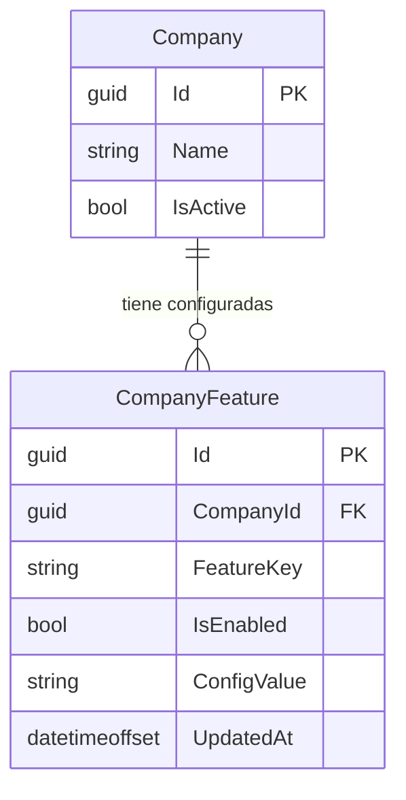

# Plan 001: Sistema de Características por Empresa (Company Features / Feature Flags) y Permisos de Laboratorio para Recepcionistas

**Fecha:** 2026-09-25  
**Estado:** Propuesto / Aprobado para Ejecución  
**Autor:** Antigravity / EraB Architecture Team  
**Tareas Asociadas:** [`tasks/001-company-features-and-receptionist-lab-permissions.md`](../tasks/001-company-features-and-receptionist-lab-permissions.md)

---

## 1. Requerimiento Original y Necesidad de Negocio

> **Requerimiento del Usuario:**
> *"Actualmente tenemos recepcionista y laboratorista. No todas las empresas tendrán el área de laboratorio, por lo cual debemos de tener alguna manera de definir que el recepcionista puede o no crear estudios de laboratorio en un cliente. Aparte también tenemos que definir un plan para mostrar o no en las empresas el área de citas y el área de estudios, tal vez un feature flag. Dame tus findings, la mejor decisión y el mejor plan para esto, es importante generar nuevas ideas."*

### Tipología de Empresas en EraB:
1. **Empresas Tipo Consultorio / Clínica Médica:**
   * Requieren Agenda y Citas Médicas (`MODULE_SCHEDULING = true`).
   * No disponen de laboratorio ni toma de muestras (`MODULE_LABORATORY = false`).
   * La navegación y endpoints de laboratorio deben estar completamente ocultos e inaccesibles.
2. **Empresas Tipo Laboratorio de Análisis Clínicos Puro:**
   * No ofrecen citas médicas con especialistas (`MODULE_SCHEDULING = false`).
   * Requieren catálogo de estudios y órdenes de laboratorio (`MODULE_LABORATORY = true`).
   * El **Recepcionista** en mostrador es quien recibe al paciente ambulatorio, selecciona los estudios y crea la orden de laboratorio (`ALLOW_RECEPTIONIST_STUDY_ORDERS = true`).
3. **Empresas Tipo Centro Médico Integral:**
   * Cuentan con citas médicas y laboratorio clínico integrados (`MODULE_SCHEDULING = true`, `MODULE_LABORATORY = true`).
   * La empresa decide mediante configuración si el recepcionista puede o no emitir órdenes de laboratorio (`ALLOW_RECEPTIONIST_STUDY_ORDERS = true/false`).

---

## 2. Hallazgos en el Código Actual (Findings)

1. **Entidad `Company` plana:**
   * En `backend/MedApp.Domain/Entities/Company.cs`, la empresa solo tiene campos básicos (`Name`, `TaxId`, `Address`, `Phone`, `Email`, `IsActive`, `Description`). No cuenta con flags ni modularidad.
2. **Navegación acoplada únicamente al Rol:**
   * En `frontend/src/app/layout/shell.component.ts` y `frontend/src/app/app.routes.ts`, los menús "Agenda y Citas" y "Estudios y Laboratorio" solo evalúan `authService.canAccessScheduling()` y `authService.canAccessStudies()`. Un usuario ve todos los módulos a los que su rol le da permiso, sin importar si la empresa activa los tiene contratados.
3. **Restricción dura en la API para Recepcionistas:**
   * En `backend/MedApp.Api/Controllers/StudyOrdersController.cs`, `POST /api/study-orders` está restringido con `[Authorize(Roles = "SuperAdmin,Admin,Specialist,Laboratorist")]`, excluyendo totalmente al rol `Receptionist` a nivel de controlador y servicio.

---

## 3. Decisión Arquitectónica: Tabla Dedicada `CompanyFeatures` (Feature Flags Multi-Tenant)

### Evaluación de Alternativas:
* **Alternativa A (Columnas directas en `Company`):** Agregar booleanos (`HasScheduling`, `HasLaboratory`, etc.).  
  * *Desventaja:* Requiere migraciones de esquema cada vez que se agregue un nuevo módulo (Farmacia, Facturación, etc.).
* **Alternativa B (Tabla dedicada `CompanyFeatures` - SELECCIONADA):**  
  * *Ventaja 1 (Cero Migraciones a Futuro):* Nuevos módulos se agregan simplemente insertando una nueva clave en el catálogo.
  * *Ventaja 2 (Separación de Conceptos):* Permite gestionar tanto **Módulos de Sistema** (vistas/rutas) como **Políticas Operativas** (permisos de rol por empresa).
  * *Ventaja 3 (UI Dinámica en SuperAdmin):* El formulario de creación/edición de empresa renderiza switches por categoría dinámicamente.

### Modelo de Datos:

---

## 4. Catálogo de Características Iniciales

| Categoría | `FeatureKey` | Nombre Visible | Descripción | Valor por Defecto |
| :--- | :--- | :--- | :--- | :--- |
| **Módulo** | `MODULE_SCHEDULING` | Agenda y Citas Médicas | Habilita calendario, turnos y citas con especialistas. | `true` |
| **Módulo** | `MODULE_LABORATORY` | Laboratorio Clínico | Habilita catálogo de estudios, órdenes y captura de resultados. | `false` |
| **Política** | `ALLOW_RECEPTIONIST_STUDY_ORDERS` | Recepción crea Estudios | Permite al rol Recepcionista registrar órdenes de laboratorio. | `false` |

---

## 5. Nuevas Ideas y Casos de Uso Integrados

1. **Presets Rápidos en SuperAdmin:**
   * Al crear o editar una empresa, ofrecer plantillas predefinidas:
     * *Clínica Médica Estándar* (Citas ON, Lab OFF).
     * *Laboratorio Clínico* (Citas OFF, Lab ON, Recepción crea estudios ON).
     * *Centro Médico Integral* (Citas ON, Lab ON).
     * *Personalizado* (Toggles individuales).
2. **Seguridad y Control en 2 Capas:**
   * **Backend:** Validación de negocio en `StudyOrderService` (comprueba que `MODULE_LABORATORY` esté activo y valida `ALLOW_RECEPTIONIST_STUDY_ORDERS` para recepcionistas).
   * **Frontend:** `moduleGuard` en `app.routes.ts`, menú adaptativo en `shell.component.ts` y control de visibilidad en la ficha del paciente.

---

## 6. Plan de Implementación por Fases

* **Fase 1: Dominio y Persistencia (Backend):** Entidad `CompanyFeature`, constantes `CompanyFeatureKeys`, `MedAppDbContext`, migración EF Core y `DbInitializer`.
* **Fase 2: Capa de Aplicación y Lógica de Negocio (Backend):** DTOs de empresa con mapa de features, extensiones de consulta, sincronización en `CompanyService` y validaciones en `StudyOrderService`.
* **Fase 3: API REST y Pruebas Backend:** Ajuste de `[Authorize]` en `StudyOrdersController` y pruebas unitarias/integración en `MedApp.Tests`.
* **Fase 4: Frontend Core (Modelos, Contexto y Guards):** Actualización de `models.ts`, métodos y signals en `CompanyContextService`, y `moduleGuard` en `app.routes.ts`.
* **Fase 5: Frontend UI (Sidebar, Ficha Paciente y SuperAdmin):** Filtros en `shell.component.ts`, botón en `patient-studies-tab.component.ts` y switches configurables en `company-list.component.ts`.
